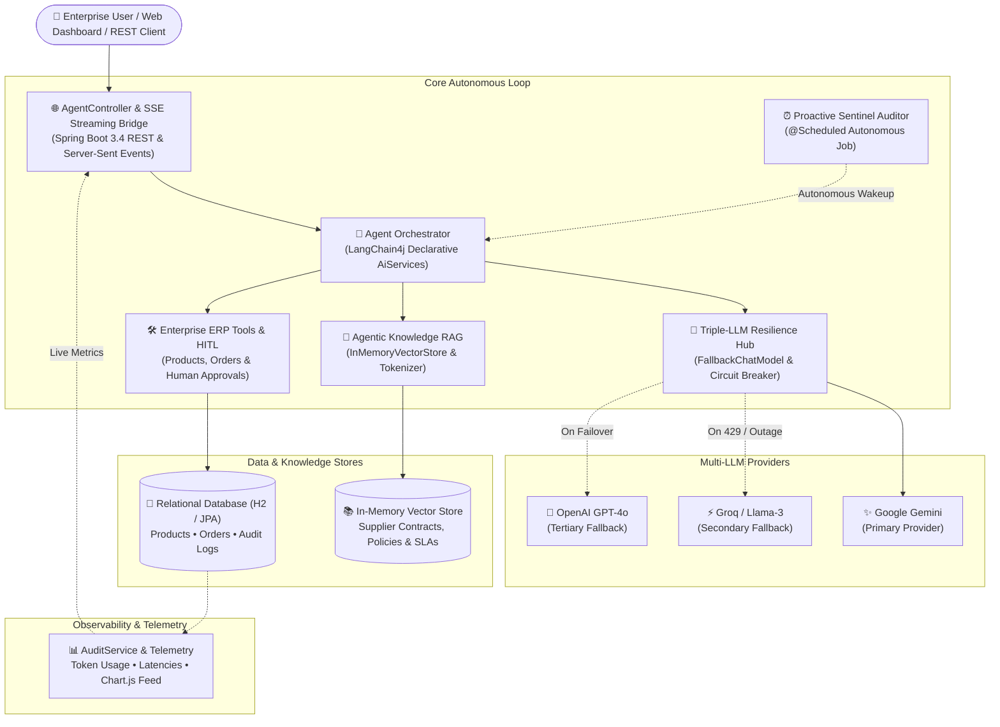

# 🤖 java-ai-agent — Enterprise Autonomous AI Agent in Java 21 & Spring Boot 3

[](https://www.oracle.com/java/)
[](https://spring.io/projects/spring-boot)
[](https://github.com/langchain4j/langchain4j)
[](https://hibernate.org/)
[](https://opensource.org/licenses/MIT)

**java-ai-agent** is a production-grade, enterprise-ready Autonomous AI Agent backend built with **Java 21**, **Spring Boot 3**, and **LangChain4j**. It features **Triple-LLM Resilience with Automatic Failover** (Google Gemini, Groq / Llama-3, and OpenAI), **Agentic RAG with In-Memory Vector Search**, **Human-in-the-Loop (HITL) Approval Workflows**, **Proactive Autonomous Background Monitoring**, and a **Real-Time SSE Streaming Web Dashboard with Chart.js Analytics**.

---

## 🏛️ Architecture Overview



---

## 🌟 Key Engineering Capabilities

### 1. 🔄 Triple-LLM Resilience & Circuit-Breaker Fallback
High availability is critical for production AI systems. The agent utilizes custom `FallbackChatModel` and `FallbackStreamingChatModel` implementations:
* **Primary LLM:** Google Gemini (`gemini-3.5-flash`).
* **Secondary LLM:** Groq (`openai/gpt-oss-120b` or Llama-3).
* **Tertiary LLM:** OpenAI (`gpt-4o-mini`).
* If the primary model encounters a rate limit (HTTP 429), quota exhaustion, or server timeout, the request seamlessly transitions to the next available provider with **zero user-facing downtime**.

### 2. 🧠 Agentic RAG (Retrieval-Augmented Generation)
The agent does not blindly query SQL tables; it understands corporate legal contracts and internal operational policies:
* **Vector Embeddings:** Uses a lightweight in-memory vector store (`InMemoryEmbeddingStore`) with an embedded embedding model (`SimpleEmbeddingModel`), requiring zero external vector database infrastructure.
* **Semantic Search:** When a user asks about supplier terms (e.g., delivery time frames, delay penalties, zero-dead-pixel guarantees), the agent invokes `searchContractsAndPolicies` tool to retrieve relevant clauses and formulate grounded answers.

### 3. 🛡️ Human-in-the-Loop (HITL) Decision Guardrails
Autonomous tools must operate safely within corporate financial limits:
* **Threshold Guardrail:** Any purchase order with a quantity exceeding 20 units or a total value above 100,000 TL is automatically locked in `DIREKTOR_ONAYI_BEKLIYOR` (Director Approval Required) status.
* **Dual Approval Channels:**
  * **Via Natural Language:** Users can instruct the agent in chat (*"Approve order PO-31626"*), triggering the `approveOrder` tool.
  * **Via Web Dashboard:** Managers can approve or reject orders with a single click, instantly updating the order status and crediting product stock in the database.

### 4. 🤖 Proactive Autonomous Sentinel (`@Scheduled` Agent)
The agent is not just a passive question-answering bot:
* Powered by Spring's `@Scheduled` background engine, `ProactiveAgentService` periodically scans inventory levels.
* Detects items falling below safety thresholds and cross-references supplier contracts to calculate delivery lead times and SLA breach risks.
* Emits structured **`ProactiveAlert`** reports with actionable recommendations, viewable in the dashboard or triggered on demand via REST.

### 5. 🌊 Real-Time SSE Streaming with Lossless Formatting
* Responses stream word-by-word into the web UI via **Server-Sent Events (SSE)** and LangChain4j's reactive `TokenStream`.
* **JSON-Wrapped Token Stream:** Tokens are transmitted as structured JSON payloads (`{"token": "..."}`) to prevent standard browser `EventSource` whitespace trimming.
* **Rich Markdown & Table Rendering:** Integrated `marked.js` with responsive CSS dynamically formats markdown tables, bullet points, and code blocks in real time.

### 6. 📊 Full Observability & Audit Trail
* Implements LangChain4j's `ChatModelListener` to capture detailed metrics for every AI interaction:
  * Model provider utilized (Gemini, Groq, OpenAI).
  * Prompt tokens, completion tokens, and total token usage.
  * Execution latency in milliseconds (`executionDurationMs`).
  * Executed `@Tool` methods with input parameters.
* All metrics are permanently persisted in the `agent_audit_logs` table for compliance and cost auditing.

### 7. 📈 Interactive Analytics & Data Visualization (Chart.js)
* The dashboard includes visual charts powered by Chart.js:
  * **Inventory vs. Critical Threshold (Bar Chart):** Visualizes on-hand stock against safety thresholds, highlighting critical items in red.
  * **Model Distribution & Token Consumption (Doughnut Chart):** Illustrates the proportion of queries served by each model provider and cumulative token burn.

---

## 🚀 Quick Start Guide

### Prerequisites
* **Java 21 LTS**
* Maven 3.8+ (or use the included Maven Wrapper `mvnw`)
* At least one valid API key from Google Gemini, Groq, or OpenAI

### 1. Configuration (.env)
Clone the repository and copy the environment template:

```bash
git clone https://github.com/sezerdemir7/java-ai-agent.git
cd java-ai-agent
cp .env.example .env
```

Edit `.env` and insert your API keys:

```env
# Google Gemini API Key (Primary)
GEMINI_API_KEY=your_gemini_api_key_here

# Groq API Key (Backup / Failover)
GROQ_API_KEY=your_groq_api_key_here

# OpenAI API Key (Optional)
OPENAI_API_KEY=your_openai_api_key_here
```

> **Security Note:** `.env` is registered in `.gitignore` and will never be committed to Git.

### 2. Build and Run
Start the application using the Maven wrapper:

```bash
# Windows
.\mvnw.cmd spring-boot:run

# Linux / macOS
./mvnw spring-boot:run
```

Once started:
* **Web UI Dashboard:** [http://localhost:8080](http://localhost:8080)
* **H2 Web Console:** [http://localhost:8080/h2-console](http://localhost:8080/h2-console)  
  * *JDBC URL:* `jdbc:h2:mem:agentusdb`
  * *Username:* `sa`
  * *Password:* *(empty)*

---

## 📂 Project Architecture & Package Structure

```
com.aiagent
├── agent/            # Declarative AI Agent interface (LangChain4j AiServices)
├── config/           # Spring & AI Bean configurations, Fallback wires, DataInitializer
├── controller/       # REST API endpoints, SSE Streaming, HITL actions
├── domain/           # JPA Entities (Product, PurchaseOrder, AgentAuditLog)
├── rag/              # In-Memory Vector Store & Semantic Contract Knowledge Base
├── repository/       # Spring Data JPA Repository interfaces
├── resilience/       # FallbackChatModel & FallbackStreamingChatModel implementations
├── service/          # Observability AuditService & ProactiveAgentService
└── tools/            # Enterprise Business Tools (@Tool services for ERP & HITL)
```

---

## 🔌 REST API Reference

| Method | Endpoint | Description |
| :--- | :--- | :--- |
| `POST` | `/api/agent/chat` | Synchronous agent chat interaction |
| `GET` | `/api/agent/chat/stream?sessionId=...&message=...` | Reactive SSE streaming chat endpoint |
| `GET` | `/api/agent/status` | Real-time dashboard status (inventory, orders, audits, proactive alerts) |
| `POST` | `/api/agent/orders/{orderNumber}/approve` | Human-in-the-Loop order approval (updates stock) |
| `POST` | `/api/agent/orders/{orderNumber}/reject` | Human-in-the-Loop order rejection |
| `POST` | `/api/agent/proactive-scan` | Manually triggers the autonomous background sentinel |
| `GET` | `/api/agent/audit-logs` | Fetches historical AI execution audit records |

---

## 🧪 Running Automated Tests

To run the complete test suite:

```bash
# Windows
.\mvnw.cmd test

# Linux / macOS
./mvnw test
```

The test suite validates Spring Context loading, entity repositories, and end-to-end tool execution against live model failover chains.

---

## 📄 License
This project is licensed under the [MIT License](LICENSE).
